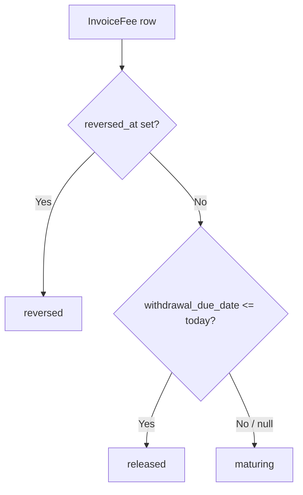
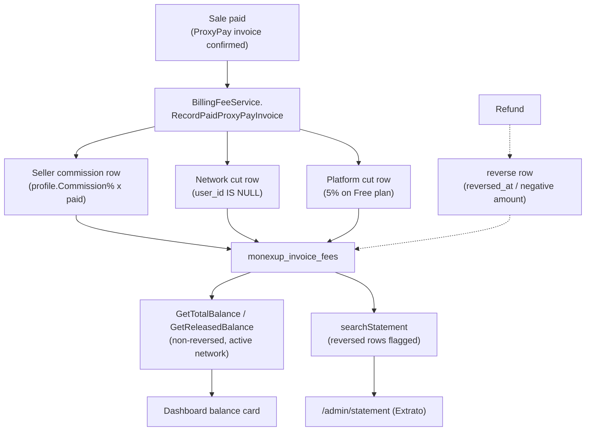

# Commission Ledger

> Read-only commission balance and statement ("Extrato"): a member (Seller)
> sees the total value of commissions earned from paid sales in the active
> network; a Network Manager sees the network's own-cut figures. Withdrawal is
> out of scope.

**Created:** 2026-07-06
**Last Updated:** 2026-07-06

---

## Overview

Commissions earned from paid sales are stored as **`InvoiceFee`** rows — one
row per network, per recipient. This feature exposes those rows as a reliable
**total commission balance** plus a dedicated **statement ("Extrato")** page,
and fixes the balance calculation that previously returned ~0.

- **Seller** — sees their **personal** commission balance and a statement of
  every commission they received.
- **Network Manager** — sees the **network's own cut** (commission records
  whose recipient is the network, not an individual member), shown separately.
- **Plain User** — no balance.

The whole feature is **read-only**: it visualizes the commission ledger but
never writes to it. Generation and reversal remain owned by the billing /
reconciliation services (see [Generation flow](#generation-flow-verified-unchanged)),
and **withdrawal / payout settlement is out of scope** — nothing consumes the
recorded commissions.

- **No new table, no migration.** The feature reuses the existing
  `monexup_invoice_fees` table. The columns it needs (`reversed_at`,
  `withdrawal_due_date`, `role`, `paid_amount_cents_at_record`) already
  existed; only read queries and one read-model field change.
- Balance and statement are scoped to the **active (selected) network**,
  consistent with the other admin pages — there is no cross-network
  aggregation.

Referral attribution (who invited whom) is a prerequisite for correct seller
attribution and is described in [`REFERRER_INVITE.md`](./REFERRER_INVITE.md).

---

## Balance Definitions

All sums are scoped to a single `(networkId, userId)` pair — the **active
network** and the identity derived from the session.

| Term | Definition |
|------|------------|
| **total** | Σ `amount` of non-reversed earned commissions (`paid_at IS NOT NULL AND reversed_at IS NULL`) for the member in the active network. Includes commissions not yet matured. |
| **released** | The matured (withdrawable) portion of `total` — same predicate **and** `withdrawal_due_date <= today`. |
| **maturing** | `total − released` — earned but not yet released for withdrawal. |

For a **Network Manager** viewing the network's own cut, the same three sums
are computed with `user_id IS NULL` and `network_id = X`, only for a network
the caller manages.

### The balance fix

`InvoiceFeeRepository.GetBalance` previously filtered on `paid_at IS NULL`. But
every fee row is written with `paid_at` **set**, so the predicate matched
nothing and the balance returned effectively **zero** (phantom-zero balance).

The predicate is fixed to:

```text
paid_at IS NOT NULL AND reversed_at IS NULL
```

Two scoped helpers were added on top:

- **`GetTotalBalance(networkId, userId)`** — the `total` sum above.
- **`GetReleasedBalance(networkId, userId)`** — the `released` sum
  (adds `withdrawal_due_date <= today`).

Both accept `userId IS NULL` to compute the **network own-cut** figures for the
manager view. `maturing` is derived as `total − released`.

---

## Reversal

A commission is reversed when its source sale is refunded — the row's
`reversed_at` is set (full reversal), or a negative-`amount` row is written
(partial refund).

- Reversed rows are **excluded from every balance sum** (`reversed_at IS NULL`
  guard).
- Reversed rows are **kept in the statement** and clearly **flagged**
  (`reversed = true`, `status = "reversed"`), so the effect on the total is
  auditable.

To make this possible the domain read model now surfaces the reversal marker:
`IInvoiceFeeModel` / `InvoiceFeeModel` gain **`ReversedAt`** (`DateTime?`),
mapped in `InvoiceFeeRepository.DbToModel` (it was previously dropped).

---

## Status Derivation

Each statement row's status is **computed, not stored**, in this order:



- **reversed** — `reversed_at != null`.
- **released** — not reversed AND `withdrawal_due_date <= today` (matured,
  withdrawable).
- **maturing** — not reversed AND (`withdrawal_due_date` null OR `> today`).

---

## Ownership Scoping (Security)

Identity is **server-derived from the session** (`GetUserInSession`). The
balance and `searchStatement` reads **never trust a client-supplied `userId`**.

- **Member (Seller)** — every read is forced to `userId = session.UserId` and a
  single `networkId` the member belongs to. A client-supplied `userId` is
  ignored (FR-007). A member cannot retrieve another member's data.
- **Network Manager** — network own-cut figures (`userId IS NULL`) only for a
  `networkId` where the caller's `UserNetwork.Role == NetworkManager`;
  otherwise **403** (FR-007a).
- A member requesting a network they don't belong to gets an empty result /
  403 — **no leak**.

---

## Endpoints

Changes on `BillingController` (MonexUp API, base `/Billing`, `NAuth` scheme,
JSON camelCase). Generation / payment endpoints are unchanged.

| Method | Path | Auth | Purpose |
|--------|------|------|---------|
| `GET`  | `/Billing/my-balance/{networkId}` | `[Authorize]`, identity = session | Session member's balance in `networkId`. Returns `MemberBalanceInfo`. |
| `GET`  | `/Billing/network-balance/{networkId}` | `[Authorize]` **and** caller manages `networkId` | Network own-cut balance (`user_id IS NULL`). 403 if the caller does not manage the network. |
| `POST` | `/Billing/searchStatement` | `[Authorize]`, identity = session | Paged statement, now session-scoped, with `reversed` / `status` fields. |
| `GET`  | `/Billing/getBalance`, `/Billing/getAvailableBalance` | `[Authorize]` | Legacy — predicate **fixed**, kept for backward compatibility. |

### `MemberBalanceInfo`

```json
{ "total": 60.0, "released": 40.0, "maturing": 20.0 }
```

- A member with no commissions gets all zeros (**200**, not an error).
- `401` when there is no session; `403` on `network-balance` when the caller
  does not manage the network.

### `POST /Billing/searchStatement`

Request `StatementSearchParam { networkId, pageNum }` — any client-supplied
`userId` is **ignored**. Server-side scoping:

- **Member** → results forced to `userId = session.UserId`, `networkId`.
- **Network Manager of `networkId`** → network own-cut rows (`userId IS NULL`).

Response `200` — a paged list of `StatementInfo` (existing fields **plus**
`reversed: bool` and `status: "released" | "maturing" | "reversed"`), newest
first, page size 15. Reversed rows are included and flagged; balance sums
exclude them.

### Legacy endpoints

`getBalance` / `getAvailableBalance` had the same `paid_at IS NULL` bug and are
fixed to the correct predicate. They remain for backward compatibility, but the
frontend **migrates to** `my-balance` (member) and `network-balance` (manager).
If retained, their identity/scoping follows the same session-derived rules —
no trusting a client `userId`.

### DTO summary (`MonexUp.DTO/Invoice`)

| DTO | Fields |
|-----|--------|
| `MemberBalanceInfo` *(new)* | `total: double`, `released: double`, `maturing: double` |
| `StatementInfo` *(extended)* | …existing… + `reversed: bool`, `status: string` |

Existing `StatementInfo` fields: `feeId`, `proxyPayInvoiceId`, `networkId`,
`networkName`, `userId`, `buyerName`, `sellerId`, `sellerName`, `description`,
`amount`, `paidAt`, `withdrawalDueDate`.

---

## Frontend

Reuses the existing **Invoice** module (Service → Business → Provider); no new
entity module is introduced.

- `Services/Impl/InvoiceService` — adds `getMyBalance(networkId)` and
  `getNetworkBalance(networkId)`; scopes the statement/balance calls to the
  active network.
- `Business/Impl/InvoiceBusiness` — adds `getMyBalance` / `getNetworkBalance`
  (session token + network id).
- `Contexts/Invoice/InvoiceProvider` — exposes `total` / `released` /
  `maturing` and the statement for the active network.
- **Dashboard balance card** (`/admin/dashboard`) — a Seller reads
  `my-balance`; a Network Manager reads `network-balance`. The card reconciles
  with the statement total.
- **`StatementPage`** (`Pages/Admin/StatementPage`, route `/admin/statement`) —
  the dedicated **"Extrato"** page: paged list of every commission, each row
  showing date paid, source (network / product / buyer / seller), amount, and
  status (released / maturing / reversed). Reversed rows are visually
  distinguished with amounts signed correctly.
- **`AdminSidebar`** — adds the **"Extrato"** menu item.

i18n keys are added for **pt / en / es / fr**. Monetary values are presented in
the network's currency.

---

## Generation Flow (verified, unchanged)

`BillingFeeService.RecordPaidProxyPayInvoice` was **verified but not changed** by
this feature. It runs when a ProxyPay invoice is confirmed paid:

- **Seller commission** = `profile.Commission%` × paid amount, recorded for the
  direct seller and held until withdrawal.
- **Idempotent** on `(proxypay_invoice_id, user_id, role)` — re-processing the
  same payment creates no duplicate row.
- **Platform cut** — 5% on the Free plan — plus the **network cut**, recorded as
  separate rows (recipient = platform / network, `user_id IS NULL` for the
  network cut).
- **Refund** → the corresponding commission is **reversed** (full: `reversed_at`
  set; partial: proportional negative-`amount` row), so it stops counting toward
  the balance.
- Edge cases: seller profile commission is 0 or missing → no seller commission
  recorded (no error); seller cannot be determined → no seller commission
  (network/platform cuts unaffected).



---

## Data Model

**No new tables, no migration.** Reuses `monexup_invoice_fees`.

| Column | Role in this feature |
|--------|----------------------|
| `fee_id` (PK) | Statement row id. |
| `proxypay_invoice_id` | Source paid invoice; part of the idempotency unique index `(proxypay_invoice_id, user_id, role)`. |
| `network_id` | Network scope. `NULL` for platform-level cut. |
| `user_id` | Recipient member. **`NULL` = network's own cut** (manager view). |
| `amount` | Commission value (negative for partial-refund reversal rows). |
| `paid_at` | When the source sale was paid. Always set for real rows. |
| `withdrawal_due_date` | Maturity: released for withdrawal once `<= today`. |
| `reversed_at` | Set on full refund reversal. **Now surfaced in the read model.** |
| `role` | Recipient role slot. Unused by this feature (single-level). |
| `paid_amount_cents_at_record` | Audit of gross paid. Not surfaced. |

The only read-model change: `IInvoiceFeeModel` / `InvoiceFeeModel` gain
`ReversedAt`, mapped in `InvoiceFeeRepository.DbToModel`.

---

## Out of Scope

- **Withdrawal / payout settlement** — creating, approving, or settling
  withdrawals; decrementing commissions on withdrawal. Today only a maturity
  date (`withdrawal_due_date`) links to it; nothing consumes commissions.
- **Multi-level (MMN) commission** distribution up the referrer chain and any
  use of profile Level for tiered payouts. Only the **direct seller's**
  commission is in scope.
- **Changes to the generation / payment flow** —
  `BillingFeeService.RecordPaidProxyPayInvoice`, the ProxyPay integration,
  webhook, and reconciliation cadence are unchanged.
- Statement filter controls (date/status/network filters) beyond basic
  pagination.
- Editing or manually adjusting commissions.
