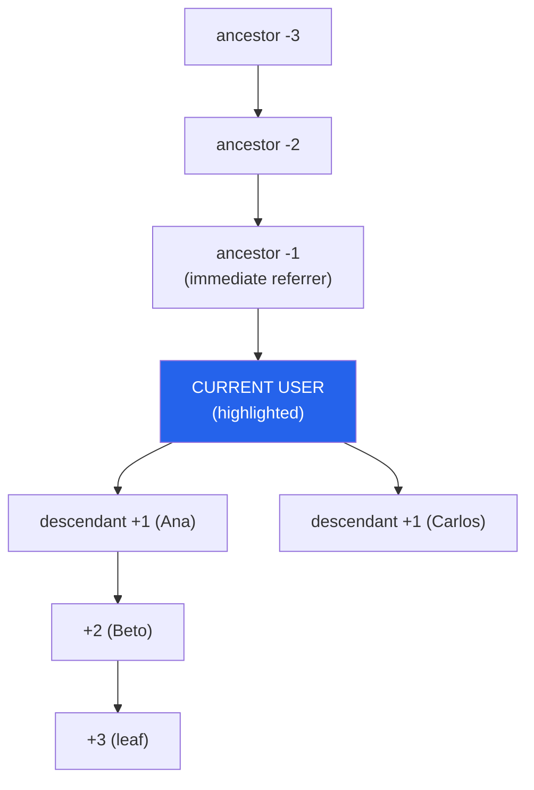

# Hierarchy Tree

> Read-only admin page ("Árvore Hierárquica") that renders the logged-in member's referrer chain (3 levels up) and referred members (3 levels down) within the active network.

**Created:** 2026-07-06
**Last Updated:** 2026-07-06

---

## Overview

The **Hierarquia** menu item (sidebar label) opens a read-only page titled
**"Árvore Hierárquica"** that draws a top-to-bottom flowchart of the currently
logged-in member's referrer relationships, **scoped to the active network**:

- Up to **3 referrer levels above** — the chain of people who invited the member
  (immediate referrer, then their referrer, up to 3 hops).
- Up to **3 referred levels below** — the members the user invited, and the
  members those people invited, branching where a member referred more than one
  person.
- The **current user** sits in the center and is visually highlighted.

Each node shows four fields: **Nome**, **Profile**, **Role**, and **Status**.
All member statuses are rendered (Active, WaitForApproval, Inactive, Blocked) —
`Status` is a displayed field that visually differentiates nodes, never a filter.
Wide branches (a member who referred many people) render **collapsed** by default
with an expand/collapse control so the view stays usable and fast.

The page is **read-only** — it visualizes referrer relationships but never edits
them. A member only ever sees **their own** position; there is no arbitrary
other-user drill-down.

---

## Data Source

The tree is derived entirely from the existing `UserNetworks.ReferrerId` column,
populated by feature 009 (see [`REFERRER_INVITE.md`](./REFERRER_INVITE.md)).

- **No new table, no migration.** It reads the existing `monexup_user_networks`
  table and reuses `ReferrerId`, `ProfileId`, `Role`, and `Status`.
- `ReferrerId` is a per-membership attribute, so the hierarchy is inherently
  **per-network** — the tree is built for the active/selected network, consistent
  with other admin pages.

---

## Tree Shape



`ancestors` is linear (each membership has at most one referrer); `descendants`
branch and nest their own `children` down to level +3.

---

## Backend

### Endpoint

`GET /Network/hierarchy/{networkId}` on `NetworkController` (base `/Network`,
`NAuth` scheme). JSON, camelCase.

- **Authorization:** `[Authorize]`. The caller is taken from the session
  (`GetUserInSession(HttpContext)`); the tree is always built for
  `session.UserId`, never for an arbitrary user id.
- **Path param:** `networkId` (long) — the active network to scope the tree to.
  The caller must belong to `networkId`, otherwise the result is
  not-found / `sucesso:false` (no leak of another network's tree). No session
  → `401`.

### Response DTOs (`MonexUp.DTO/Network`)

| DTO | Fields |
|-----|--------|
| `HierarchyNodeInfo` | `userId:long`, `name:string`, `profileName:string`, `role:UserRoleEnum`, `status:UserNetworkStatusEnum`, `children:HierarchyNodeInfo[]` |
| `HierarchyInfo` | `networkId:long`, `current:HierarchyNodeInfo`, `ancestors:HierarchyNodeInfo[]`, `descendants:HierarchyNodeInfo[]` |

- `ancestors` — the referrer chain, ordered **immediate referrer first**
  (index 0 = level −1, last = level −3), length ≤ 3. Linear, so `children` is
  unused here.
- `descendants` — direct referred members (level +1), each nesting its own
  `children` down to level +3.
- `name` / `profileName` may be `null` when unresolved — the node still renders
  with its other fields.

```json
{
  "networkId": 12,
  "current": {
    "userId": 87, "name": "Você", "profileName": "Vendedor",
    "role": 2, "status": 1, "children": []
  },
  "ancestors": [
    { "userId": 40, "name": "Maria (referrer)", "profileName": "Gerente", "role": 4, "status": 1, "children": [] },
    { "userId": 22, "name": "João (nível -2)", "profileName": "Gerente", "role": 4, "status": 1, "children": [] }
  ],
  "descendants": [
    {
      "userId": 91, "name": "Ana", "profileName": "Vendedor", "role": 2, "status": 2,
      "children": [
        { "userId": 102, "name": "Beto", "profileName": "Vendedor", "role": 2, "status": 1, "children": [] }
      ]
    },
    { "userId": 92, "name": "Carlos", "profileName": "Vendedor", "role": 2, "status": 3, "children": [] }
  ]
}
```

### Assembly — `NetworkService.BuildHierarchy(networkId, userId, token)`

1. Resolve the caller's membership in `networkId` via `UserNetwork.Get(networkId, userId)`.
   No membership → not-found / empty result.
2. **Ascend** up to 3 levels: follow `ReferrerId`, each hop calling
   `Get(networkId, referrerId)`, stopping at `null`, an unresolved referrer, or
   after 3 hops. Collected **immediate referrer first**.
3. **Descend** up to 3 levels: traverse via a new repository query
   `UserNetworkRepository.GetByReferrer(networkId, referrerId)`, nesting
   `children`, bounded at depth 3.
4. Resolve display fields per node:
   - **Name** via NAuth `IUserClient.GetByIdAsync`, **memoized per distinct
     user id** (one call per unique member, deduped).
   - **Profile** name via the profile lookup (by `ProfileId`).
   - **Role** / **Status** carried straight from the membership record.

### `GetByReferrer` vs `ListByNetwork`

The descend step needs a **new** repository query,
`UserNetworkRepository.GetByReferrer(networkId, referrerId)`, because it must
return members of **all statuses**. The existing `ListByNetwork` filters
**Active only**, so it cannot be reused for a tree that must include
WaitForApproval, Inactive, and Blocked members.

---

## Frontend

Reuses the existing **Network** module (Service → Business → Provider); no new
entity module is introduced.

- `DTO/Domain/HierarchyInfo.tsx` — tree types mirroring the backend DTOs.
- `Services/Impl/NetworkService.tsx` — adds `getHierarchy(networkId)`.
- `Business/Impl/NetworkBusiness.tsx` — adds `getHierarchy` (session token).
- `Contexts/Network/NetworkProvider.tsx` — exposes `getHierarchy` on the
  Network context / provider interface.
- `Pages/Admin/HierarchyPage/index.tsx` — the page (title **"Árvore
  Hierárquica"**), fed by `NetworkContext.getHierarchy(networkId)`.
- `Pages/Admin/HierarchyPage/TreeNode.tsx` — recursive, collapsible node/tree
  component.
- `Pages/Admin/HierarchyPage/hierarchy.css` — custom org-chart connectors.
- `Components/AdminSidebar.tsx` — adds the **"Hierarquia"** item to the
  `my_network` group.
- `App.tsx` — registers the `/admin/hierarchy` route.

The tree is rendered with a **custom collapsible component + CSS org-chart
connectors** — **no graph/tree library** is added. i18n keys `hierarchy` (menu
label) and `hierarchyPage.*` (page strings) are added to **pt / en / es / fr**.

---

## Rules & Limits

- **Bounded depth:** at most **3 levels up** and **3 levels down** relative to
  the current user. Ancestors/descendants beyond level 3 are not shown.
- **Per active network:** the tree is scoped to the requested `networkId`, which
  the caller must belong to.
- **All statuses:** nodes of every `Status` are included; nothing is filtered.
- **Read-only:** no referrer edits from this page.
- **Cycle-safe:** a `visited` set of user ids prevents re-expanding any member,
  so looping `ReferrerId` data terminates without infinite/duplicate traversal;
  depth stays bounded.
- **Graceful empties:** no referrer → no ancestors (current user is the top);
  referred no one → empty descendant/leaf state; both render without error.
- **Missing/unresolvable referrer:** a stored referrer id that doesn't resolve to
  a member in the active network ends the chain there (not an error).

### Performance

Name resolution is **one NAuth call per distinct member** (deduped via
memoization), which is acceptable for typical networks and meets the
few-seconds page-load target for a fully populated 3-up/3-down tree. For very
wide trees, a **lazy / expand-on-demand endpoint** is a possible future
optimization.
