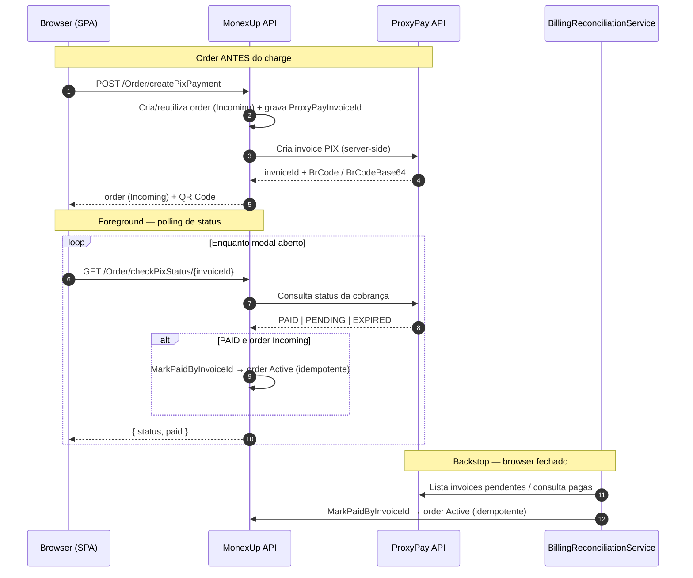

# Integração MonexUp com ProxyPay

> Documenta a arquitetura de pagamentos PIX do MonexUp: MonexUp como único gateway do ProxyPay, o ciclo de vida da order (`Incoming → Active`), as duas vias de detecção de pagamento e os endpoints de configuração da AbacatePay API key.

**Created:** 2026-07-01
**Last Updated:** 2026-07-01
**Feature branch:** `008-backend-proxypay-orders`

---

## Contexto

Antes desta mudança, o checkout falava com **dois** backends de pagamento ao mesmo tempo: a API do MonexUp e a API do ProxyPay. O fluxo da **vendor page** passava pelo MonexUp (`POST /Order/createPixPayment`) e registrava a order corretamente, mas o fluxo da **storefront** usava o pacote de browser `proxypay-react` (`<PixPayment>`) para criar a invoice PIX **diretamente no ProxyPay** — gerando uma cobrança sem order no MonexUp. Depois, o browser consultava o status **direto no ProxyPay**, então quando o comprador pagava, o MonexUp nunca era avisado e a order (quando existia) ficava `Incoming` para sempre.

Isso quebrava rastreamento de orders, comissão/settlement e qualquer relatório voltado ao gestor, porque os registros do MonexUp não refletiam o que de fato aconteceu no provedor de pagamento.

O objetivo é fazer do MonexUp a **única fonte de verdade e o único ponto de contato** com o provedor de pagamento.

---

## Princípio 1 — MonexUp é o único gateway do ProxyPay

- O browser fala **somente** com a API do MonexUp. Toda capacidade do provedor que o browser precisa (gerar cobrança/QR, checar status, configurar a store/chave) é servida por endpoints MonexUp.
- O ProxyPay é acessado **server-side** pelo MonexUp (via o `HttpClient` nomeado `"ProxyPay"` do `IHttpClientFactory`).
- Credenciais, identificação de tenant e endpoints do ProxyPay ficam **no servidor** — nunca são exigidos nem expostos ao browser (FR-010).

```
[ Browser SPA ]  --HTTPS-->  [ MonexUp API ]  --server-side-->  [ ProxyPay API ]
     (nunca fala direto com o ProxyPay)      (mantém credenciais/tenant)
```

---

## Princípio 2 — Ciclo de vida da order

Toda cobrança PIX cria uma order **antes** do charge. O estado "pago" reutiliza o enum existente — sem novo estado, sem migração.

| `OrderStatusEnum` | Valor | Significado                       |
|-------------------|-------|-----------------------------------|
| `Incoming`        | 1     | Aguardando pagamento (inicial)    |
| `Active`          | 2     | Pago / cobrança liquidada         |

Regras:

- **Order antes do charge (FR-002):** `POST /Order/createPixPayment` insere/reutiliza uma order `Incoming` **antes** de gerar o QR e grava o `ProxyPayInvoiceId` nela. Nenhuma cobrança pode existir sem order correspondente.
- **Reuso em retry (FR-004):** re-invocar para a mesma tripla `(product, user, seller)` ainda `Incoming` reutiliza a order existente em vez de duplicar.
- **Confirmação de pagamento (FR-006):** ao confirmar o pagamento, a order transita `Incoming → Active`.
- **Idempotência (FR-007):** a transição só ocorre quando a order está `Incoming`; se já estiver `Active`, é no-op (sem avançar duas vezes nem duplicar settlement).

---

## Princípio 3 — Duas vias de detecção de pagamento

Ambas as vias escrevem através de **uma única transição idempotente** (`IOrderService.MarkPaidByInvoiceId`), que resolve a order pelo `ProxyPayInvoiceId` (`GetByProxyPayInvoiceId`) e aplica `Incoming → Active`.

### (a) Foreground — enquanto o browser está no checkout

`GET /Order/checkPixStatus/{proxyPayInvoiceId}` consulta o status no ProxyPay e, quando pago, avança a order para `Active`. É a via que o comprador vê no modal do QR.

### (b) Backstop — caso browser-fechado

O `BillingReconciliationService` (background, no `MonexUp.BackgroundService`) detecta invoices pagas de forma independente e aplica a **mesma** transição, cobrindo o caso em que o comprador fecha o browser logo após pagar (SC-003). O MonexUp não depende só do browser para saber do pagamento.

```
Foreground:  Browser → GET /Order/checkPixStatus/{id} → ProxyPay → MarkPaidByInvoiceId → order Active
Backstop:    BillingReconciliationService (background) → ProxyPay → MarkPaidByInvoiceId → order Active
```

---

## Diagrama — fluxo de checkout PIX



---

## Endpoints AbacatePay API key (proxy, write-only)

Move a configuração da AbacatePay key do caminho direto browser→ProxyPay para o MonexUp, que relaia server-side (FR-009, FR-010). NAuth bearer obrigatório; o chamador deve gerenciar a network alvo. A chave **nunca** é devolvida ao browser.

### `PUT /Network/{networkId}/abacatepay-apikey` (novo — write-only)

Grava a AbacatePay API key na store ProxyPay da network.

**Request**
```json
{ "apiKey": "string (required)" }
```

| Status | Significado                                                        |
|--------|-------------------------------------------------------------------|
| 204    | Chave armazenada no provedor                                      |
| 400    | Validação / nenhuma store provisionada (`{ sucesso, mensagem }`)  |
| 403    | Chamador não é o dono da store                                    |

**Backend:** resolve o `ProxyPayStoreId` da network → `IProxyPayClient.SetAbacatePayApiKeyAsync(storeId, apiKey, bearerToken)` → `PUT {ProxyPay}/Store/{storeId}/abacatepay-apikey`.

### `GET /Network/{networkId}/abacatepay-apikey/status` (novo — indicador)

Retorna se há uma chave configurada (nunca o valor).

**Response 200**
```json
{ "sucesso": true, "hasAbacatePayApiKey": true }
```

**Backend:** `IProxyPayClient.GetHasAbacatePayApiKeyAsync(bearerToken)` → GraphQL do ProxyPay `{ myStore { storeId hasAbacatePayApiKey } }`; retorna a flag da primeira store; `false` em qualquer falha.

---

## Componentes de backend tocados

| Camada / arquivo                                     | Mudança                                                                                     |
|------------------------------------------------------|---------------------------------------------------------------------------------------------|
| `OrderController.CheckPixStatus`                     | Além de proxiar o status, agora avança a order `Incoming → Active` quando pago               |
| `IOrderService.MarkPaidByInvoiceId` (`OrderService`) | Nova transição idempotente disparada por ambas as vias de detecção                          |
| `IOrderService.GetByProxyPayInvoiceId` (`OrderService`) | Resolve a order a partir do `ProxyPayInvoiceId` (usado por status e reconciliação)       |
| `BillingReconciliationService`                       | Backstop: aplica a mesma transição para invoices pagas com browser fechado                   |
| `IProxyPayClient.SetAbacatePayApiKeyAsync` (`ProxyPayClient`)   | Grava a AbacatePay key na store (server-side, bearer NAuth)                       |
| `IProxyPayClient.GetHasAbacatePayApiKeyAsync` (`ProxyPayClient`) | Consulta via GraphQL se a store tem chave configurada                            |
| `ProxyPayService`                                    | Passthroughs para os novos métodos do client (AbacatePay key set / hasKey)                   |
| `NetworkController`                                  | Expõe os dois endpoints de AbacatePay key (set write-only + status)                          |

---

## Limitação conhecida

`IProxyPayClient.ListPendingInvoicesAsync` **ainda é um stub** (retorna vazio). Consequência:

- A via **foreground** (`GET /Order/checkPixStatus/{invoiceId}`) **já funciona** — o comprador com o modal aberto vê a order virar `Active`.
- O **backstop** de reconciliação (`BillingReconciliationService`) só fica efetivo quando o **GraphQL de pending invoices do ProxyPay for implementado**. Até lá, o caso browser-fechado não é coberto automaticamente.

O `ProxyPay` é read-only neste repositório (`C:\repos\ProxyPay` — pedir a mudança ao dono do repositório). A implementação do listing de pending invoices depende dessa mudança externa.

---

## Referências

- Spec: `specs/008-backend-proxypay-orders/spec.md`
- Plano: `specs/008-backend-proxypay-orders/plan.md`
- Research (decisões): `specs/008-backend-proxypay-orders/research.md`
- Contratos: `specs/008-backend-proxypay-orders/contracts/order-pix.md`, `contracts/network-payment-config.md`
</content>
</invoke>
