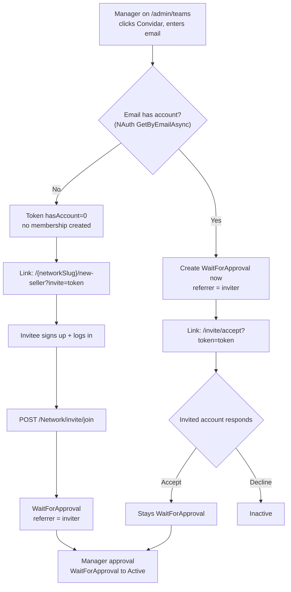

# Referrer Invite

> Manager-initiated network invites that record the inviter as the new member's referrer.

**Created:** 2026-07-03
**Last Updated:** 2026-07-03

---

## Overview

Network managers invite people into a network from `/admin/teams`. When the
invitee joins, the inviting manager is recorded as the new member's **referrer**
via the existing `user_networks.referrer_id` column.

- **No new table, no migration.** The feature reuses the existing
  `monexup_user_networks` table and its `referrer_id` column (nullable, no FK,
  holds a NAuth `UserId` by convention).
- Invited memberships still pass through the **existing manager approval** step
  (`WaitForApproval → Active`), which is unchanged.
- Self-service joins (no invite) keep an empty `referrer_id` — no false
  attribution.

---

## Two Flows

Account existence for the entered email is detected **server-side** through NAuth
`IUserClient.GetByEmailAsync` (a not-found result means "no account").

### Flow A — No account (new person)

1. Manager enters an email that has no account; the backend builds a token with
   `hasAccount = 0`, `targetUserId = 0`. **No membership is created yet.**
2. The dialog produces the link `/{networkSlug}/new-seller?invite={token}`.
3. The invitee opens the link, signs up, and logs in. The `SellerAddPage` reads
   `?invite=` and calls `POST /Network/invite/join`, enrolling the caller into
   the network as `WaitForApproval` with `referrer = inviter`.

### Flow B — Existing account (accept / decline)

1. Manager enters an email that already has an account. A `WaitForApproval`
   membership is created **immediately** (`referrer = inviter`), so the invitee
   shows in the team list before responding.
2. The dialog produces the link `/invite/accept?token={token}` (`hasAccount = 1`).
3. Only the **invited account** may respond on the accept/decline page:
   - **Accept** → confirms intent; the membership stays `WaitForApproval`
     (still needs manager approval). No status change.
   - **Decline** → the membership is set to `Inactive` (history preserved, no
     hard delete).

---

## Invite Link

The link is **stateless**, **HMAC-SHA256 signed**, has **no expiry**, and is
**reusable**. No invite record is persisted.

- **Format:** `base64url(payload) + "." + base64url(HMAC-SHA256(secret, payload))`
- **Payload:** `networkId|inviterUserId|targetUserId|hasAccount`
- Signature verification uses a constant-time comparison
  (`CryptographicOperations.FixedTimeEquals`). Tampering with any segment
  invalidates the token.

### Signing secret

The secret is read via `IConfiguration` under the key **`Invite:Secret`**
(no `Environment.GetEnvironmentVariable`). It is wired in:

| Location | Key |
|----------|-----|
| `appsettings.Development.json` | `Invite:Secret` |
| `appsettings.Docker.json` | `Invite:Secret` |
| `docker-compose.yml` | `Invite__Secret` |
| `.env.example` | `INVITE_SECRET` |

---

## Backend

- **`IInviteTokenSigner` / `InviteTokenSigner`** (`MonexUp.Domain`) — `Sign(...)`
  and `TryVerify(...)` for the token described above. Registered in
  `MonexUp.Application/Initializer.cs`.
- **`NetworkService`** methods:
  - `InviteByEmail` — resolves account existence, creates the immediate
    `WaitForApproval` membership for existing accounts (or nothing for new
    ones), and returns the signed token + `networkSlug`.
  - `JoinFromInvite` — enrolls the caller (`hasAccount = 0` path) as
    `WaitForApproval` with `referrer = inviterUserId`; idempotent.
  - `GetInviteDetail` — verifies the token and returns network + inviter display
    info plus `isForCurrentUser`.
  - `AcceptInvite` — verifies token and ownership; ensures the pending
    membership exists (idempotent, no status change).
  - `DeclineInvite` — verifies token and ownership; sets the pending membership
    to `Inactive`.
- **Endpoints** on `NetworkController` (base `/Network`, `NAuth` scheme).
  Response DTOs follow the project convention with Portuguese status fields
  (`sucesso`, `mensagemErro`).

The manager approval flow (`WaitForApproval → Active`) reuses the existing
`ChangeStatus` logic and is unchanged. Referrer attribution is preserved across
all status changes.

### Endpoint reference

| Method | Path | Auth | Purpose |
|--------|------|------|---------|
| `POST` | `/Network/invite` | Network manager/administrator of `networkId` | Generate a signed invite link; creates the immediate pending membership for existing accounts. |
| `POST` | `/Network/invite/join` | Authenticated (newly created account) | New-account path: enroll caller as `WaitForApproval` with `referrer = inviter`. |
| `GET`  | `/Network/invite/detail?token={token}` | Any authenticated user | Return network + inviter info and `isForCurrentUser`. |
| `POST` | `/Network/invite/accept` | Authenticated; caller must equal `token.targetUserId` | Confirm intent; membership stays `WaitForApproval`. |
| `POST` | `/Network/invite/decline` | Authenticated; caller must equal `token.targetUserId` | Set the pending membership to `Inactive`. |

---

## Frontend

New **Invite** module in `monexup-app` following the Service → Business → Provider
layering:

- `Services/Impl/InviteService` — HTTP client for the five endpoints.
- `Business/Impl/InviteBusiness` (+ `Business/Factory/InviteFactory`).
- `Contexts/Invite/InviteProvider` (+ `InviteContext`).
- **`InviteModal`** (`Pages/Admin/InviteModal`) — the "Convidar" dialog on
  `/admin/teams`: email input, generate link, copy affordance.
- **`AcceptInvitePage`** (`Pages/AcceptInvitePage`, route `/invite/accept`) —
  accept/decline for the invited account only.
- **`SellerAddPage`** (`Pages/SellerAddPage`) — reads `?invite=` and calls
  `invite/join` after sign-up + login.

Invite delivery is a **copyable link only** (no email in v1). i18n keys were
added for `pt`, `en`, `es`, and `fr`.

---

## Rules & Guarantees

- **Only the invited account** (`session.UserId == token.targetUserId`) may
  accept or decline; another logged-in account is prompted to sign in as the
  invited account (`isForCurrentUser = false` → 403 on accept/decline).
- **No duplicates.** An invite that resolves to a user who already has an
  `Active`/`WaitForApproval` membership does not create a second row; the
  existing state is surfaced (`alreadyMember` / `alreadyActiveMember`).
  `JoinFromInvite` and `AcceptInvite` are idempotent.
- A declined (`Inactive`) member may be reactivated to `WaitForApproval` by a
  re-invite.
